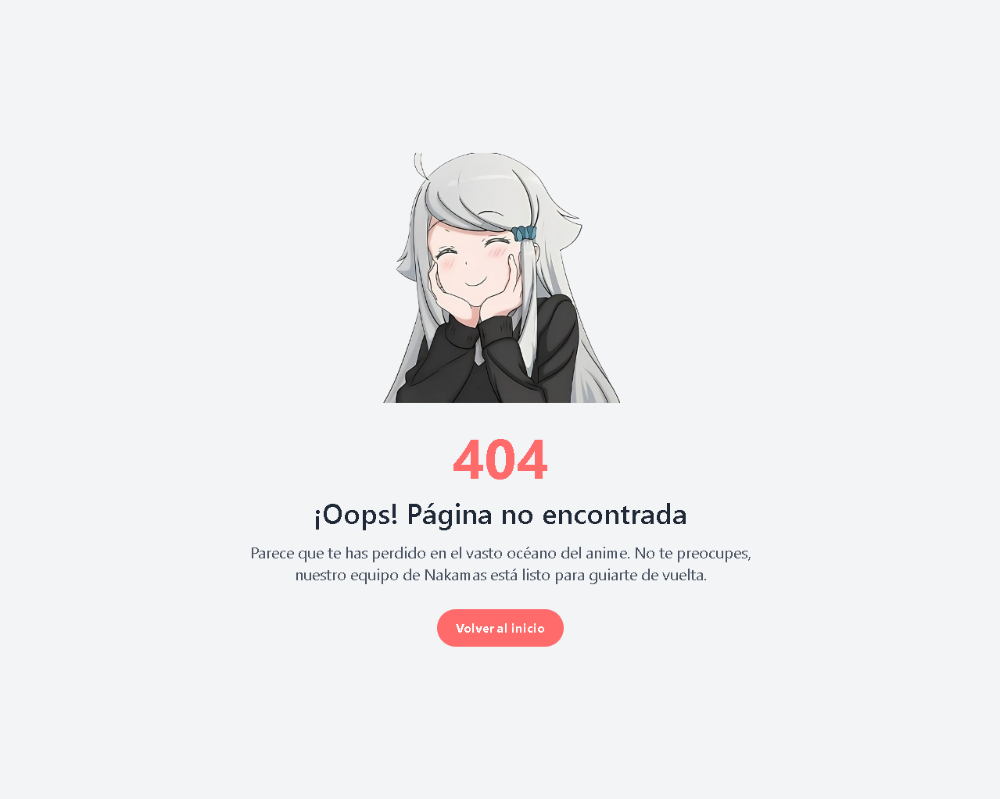

# web

**Soporte para problemas comunes en la versión web de NakamaStream: posibles soluciones**

Esta sección proporciona una guía para resolver los problemas más frecuentes que los usuarios pueden encontrar al utilizar la versión web de NakamaStream. Las soluciones propuestas están orientadas a facilitar la resolución rápida y eficiente de inconvenientes comunes.

## Errores:

### 404

El error `404` ocurre cuando la ruta de una página no es válida o no se puede encontrar. Por ejemplo, si estás en la ruta principal `("/")` y tratas de acceder a una ruta inexistente, como `"/44455"`, el sistema devolverá un error 404. Este tipo de error es común y, en general, se puede solucionar asegurándose de que la URL sea correcta.

Si te aparece este error en una página que funcionaba previamente, pero dejó de ser accesible tras una actualización, es posible que la página haya sido eliminada o movida durante ese proceso. En caso de que esto no sea así, te recomendamos ponerte en contacto con los administradores del sitio para obtener más información o asistencia.

<figure><figcaption></figcaption></figure>

### Forbidden

El error `"Forbidden" (403)` es común y ocurre cuando un usuario intenta acceder a una ruta para la cual no tiene los permisos adecuados. Un ejemplo típico de este error es cuando un usuario intenta acceder al panel de administración, que está restringido exclusivamente a los administradores.

Para solucionar este error, generalmente basta con regresar a la ruta anterior o intentar acceder a una ruta diferente a la que se tiene acceso, como "/animes", si corresponde.

### Episodio no Encontrado

Aunque no es un error común en la plataforma, el mensaje `"Episodio no encontrado"` puede ocurrir cuando se intenta acceder a Episodio que no existe. Por ejemplo, si estás viendo el anime _**Toradora!**_ y intentas buscar el episodio 26, aparecerá este mensaje, ya que dicho episodio no existe en la serie.

Otra posible causa de este mensaje podría ser un fallo en el sistema al **intentar localizar el episodio**. Si este es el caso, te recomendamos que te pongas en contacto de inmediato con el equipo de soporte a través de Discord o por correo electrónico para resolver el problema.

### Anime no Encontrado

El mensaje `"Anime no encontrado"` puede aparecer en la plataforma cuando se intenta acceder a un anime que no está disponible o que ha sido removido. Esto puede suceder si el anime que buscas nunca ha estado en la plataforma o ya no se encuentra en el catálogo.

En algunos casos, también podría ser un **problema temporal relacionado con el sistema**. Si te encuentras con este error, te sugerimos contactar al equipo de soporte a través de Discord o por correo electrónico para obtener asistencia.
